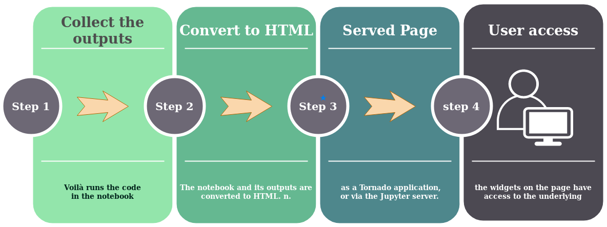

<div style="text-align: center; line-height: 0; padding-top: 9px;">
  
</div>

## __From Jupyter notebooks to standalone applications or dashboards - Notebook Example__

#### By the end of this Tutorial you will be able to install, use and master Jupyter Voilà extention! 

### __Steps shown in this Notebook:__
* #### Voila Introduction.
* #### Voila Installation.
* #### Voila How it works ?.
* #### Voila - Example : Interative web dashboard.
* #### __Bonus 💎 : voila-vuetify__

## __📖  Introduction__ 

----

### __Voilà__ turns Jupyter notebooks into standalone web applications.

* #### __Voilà__ supports Jupyter interactive widgets, including the roundtrips to the kernel.
* #### __Voilà__ does not permit arbitrary code execution by consumers of dashboards.
* #### Built upon Jupyter standard protocols and file formats, __voilà__ works with any Jupyter kernel (C++, Python, Julia), making it a language-agnostic dashboarding system.
* #### __Voilà__ is extensible. It includes a flexible template system to produce rich application layouts.


## __🖥  Installation__ 

#### There is norecommended way of installing voila both __Conda__ and __Pypi__ works well.

#### Conda way :

```sh 
$ conda install voila -c conda-forge
```

#### Pypi way :

```sh 
$ pip install voila
```

#### For newest release please check Pypi : https://pypi.org/project/voila/ or conda : https://anaconda.org/conda-forge/voila

##  __How it works__

<div style="text-align: center; line-height: 0; padding-top: 9px;">
  
</div>


### When Voilà is run on a notebook, the following steps occur:
#### 1.  Voilà runs the code in the notebook and collects the outputs
#### 2.  The notebook and its outputs are converted to HTML. By default, the notebookcode cells are hidden.
#### 3.  This page is served either as a Tornado application, or via the Jupyter server.
#### 4.  When users access the page, the widgets on the page have access to the underlying 
#### It time to mae hands durty, Let's build 🛠 some great webapps and Dashbords

##  __- Example : Interactive Web Dashboard__

#### You can check the the source code in ``./notebook/dashboard_example.ipynb``

<div style="text-align: center; line-height: 0; padding-top: 9px;">
  
</div>


# __The Bonus: voila-vuetify 🎉__

#### Both __Conda__ and __Pypi__ works well for the installation.

#### Conda way :

```sh 
$ conda install -c conda-forge voila-vuetify
```

#### Pypi way :

```sh 
$ pip install voila-vuetify
```

#### For newest release please check Pypi : https://pypi.org/project/voila/ or conda : https://anaconda.org/conda-forge/voila

## __Conclusion__ 

#### Voila easly transforms the Jupyter notebook to Dashboard application with simple CLI

# __Materials and Resources :__  📖 

####  __About Voila__ : https://voila.readthedocs.io/en/stable/install.html
####  __About voila dashboard GitHub__ :  https://github.com/voila-dashboards/voila
####  __About voila-vuetify__ :  https://blog.jupyter.org/and-voil%C3%A0-f6a2c08a4a93